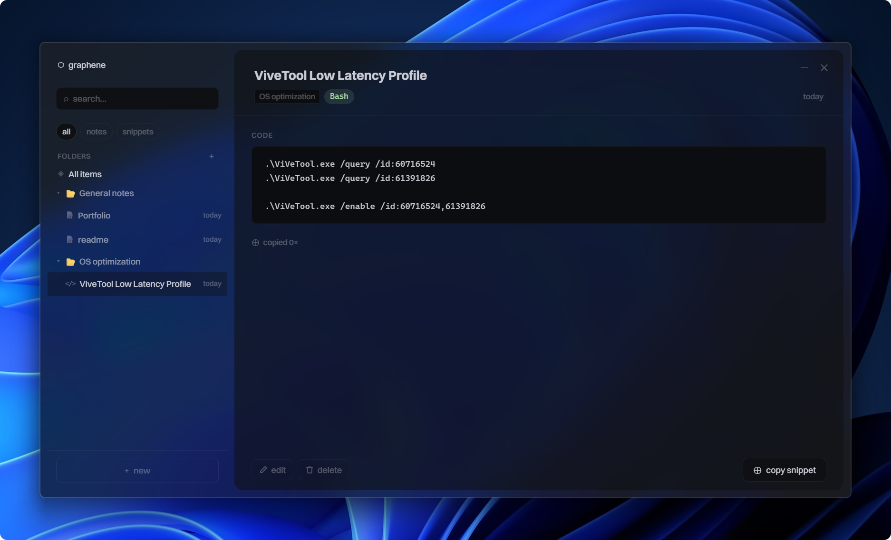

# Graphene

A minimal desktop app for writing markdown notes and storing reusable code snippets — built with Tauri v2, React 18, and TypeScript.



## Features

### Notes
- Write in plain text or switch to a live markdown preview
- Markdown formatting toolbar (bold, italic, inline code, links, etc.)
- Organize notes in nested folders

### Snippets
- Store code snippets with syntax language labels (JS, TS, CSS, SCSS, HTML, Shell)
- One-click copy to clipboard with a running copy counter
- Optional prose notes alongside each snippet

### Organization
- Hierarchical folders — nest as deep as needed
- Drag-and-drop items between folders
- Text search across all notes and snippets
- Filter by type (all / notes / snippets)

### File import
- Drop `.md`, `.js`, `.ts`, `.css`, `.scss`, `.html`, or `.sh` files directly onto the window to import them

### Editing
- Unsaved-changes indicator (dot next to title in the editor and sidebar)
- Auto-save with **Ctrl+S** — keeps the editor open
- Full save + close via the Save button

### Keyboard shortcuts

| Shortcut | Action |
|---|---|
| Ctrl+N | New item |
| Ctrl+E | Edit selected item |
| Ctrl+S | Auto-save (keep editor open) |
| Escape | Cancel / close editor |
| Del | Delete item or folder (with confirmation) |

### Storage
- File-based vault at a user-chosen directory
- Notes saved as `.md` files with YAML frontmatter
- Snippets saved with their native extension (`.js`, `.css`, etc.)
- Folders are real OS directories
- Vault location stored at `%APPDATA%\graphene\config.json`
- No cloud, no accounts — everything stays on your machine

## Stack

- [Tauri v2](https://tauri.app) — desktop shell (transparent acrylic window, no decorations)
- React 18 + TypeScript — UI
- Vite — build tooling
- SCSS + CSS custom properties — styling
- [gray-matter](https://github.com/jonschlinkert/gray-matter) — frontmatter parsing
- [Biome](https://biomejs.dev) — linting and formatting

## Development

```bash
npm install
npm run tauri dev
```

## Build

```bash
npm run tauri build
```
